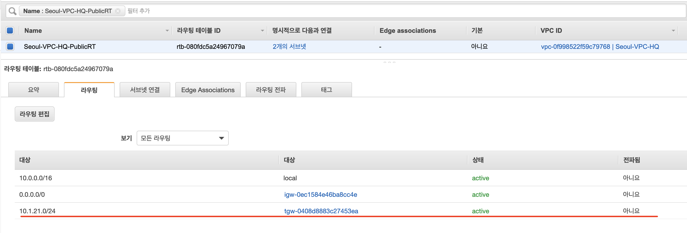

# TransitGateway 구성하기

## 1.TransitGateway 기본 구성

### 구성 아키텍쳐 소개

AWS TransitGateway의 기본 동작 이해를 위해, 가장 기본이 되는 디자인을 먼저 구성해 봅니다.

아래 그림은 이번 Chapter에서 구성해 볼 아키텍쳐 입니다. 

### Task1. VPC 구성하기

Cloudformation을 통해 기본이 되는 VPC구성을 먼저 구성합니다. 

#### 1.사전 준비하기 

서울 리전에 4개의 VPC를 구성하고, 사전에 구성된 TGW를 배포합니다.

아래 Github에서 실습에 사용할 Cloudformation yaml 파일을 다운로드 받습니다.

```text
git clone https://github.com/whchoi98/builders20210312
```

#### 2.Cloudformation 생성.

Seoul-VPC-HQ, Seoul-VPC-PRD, Seoul-VPC-STG, Seoul-VPC-DEV를 Cloudformation 을 기반으로 생성합니다.

**AWS 콘솔에서 서울 리전 \(ap-northeast-2\)를 선택하고, Cloudformation 서비스를 선택합니다.**

**Cloudformation에서 먼저 새로운 스택을 생성합니다.**


**앞서 다운로드 받은 yaml 파일들 중에 `Seoul-VPC-HQ.yml` 파일을 업로드 합니다.**

```text
Seoul-VPC-HQ.yml
```


다음을 선택하고, 아래와 같아 스택이름은 파일명과 동일하게 입력합니다. 



스택이름을 파일명과 다르게 입력하지 마십시요. 이후 과정에서 TransitGateway의 yaml파일은 , VPC yml 에서 생성된 값들을 import 해서 TGW를 생성합니다. 스택이름을 파일명과 다르게 할 경우, TGW를 생성할 때 에러가 발생합니다.


별도로 설정 변경없이, 다음 단계를 진행하고 , 승인을 선택하고 스택생성합니다.


**다운로드 받은 yaml 파일 3개를 추가로 반복적으로 수행합니다.** 

```text
Seoul-VPC-PRD.yml
Seoul-VPC-STG.yml
Seoul-VPC-DEV.yml
```

4개의 VPC가 모두 정상적으로 구성되면 아래와 같이 Cloudformation에서 확인 할 수 있습니다.  4개의 VPC는 각 3분 내외에 생성됩니다. 동시에 수행해도 가능합니다.


### Task2. TGW구성하기.

4개의 VPC를 연결할 TransitGateway를 Region에 Cloudformation으로 생성합니다.



다음을 선택하고, 아래와 같아 스택이름은 파일명과 동일하게 입력합니다. \(TGW는 스택이름을 다르게 지정해도, 본 랩을 구성하는데 문제가 없습니다.\)


5분 이내에 TransitGateway가 완성됩니다.


## 2.TransitGateway 구성 확인

### Task3.TGW 구성 확인 

AWS 관리콘솔 - VPC 를 선택합니다.

4개의 VPC가 정상적으로 생성되었는지 확인합니다.


AWS 관리콘솔 - EC2를 선택합니다.

EC2가 정상적으로 생성되었는지 확인합니다.


VPC - TransitGateway를 선택해서, Transit Gateway 정상적으로 구성되었는지 확인합니다.


### Task4. TGW Attachment 확인. 

#### `VPC-Transit Gateway-Transit Gateway 연결` 을 선택해서, Transit Gateway attachment가 정상적으로 구성되었는지 확인합니다.


Seoul-TGW-Attach-Seoul-VPC-HQ를 선택하면, 이미 "Seoul-VPC-HQ"의 TGW-Subnet ID에 연결되어 있는 것을 확인할 수 있습니다. 또한 Routing Table에 Association 된 상태도 확인이 가능합니다.

1. **TGW Routing Table과 Attachment가 연결된 상태를 확인**
2. **Attachment가 VPC의 어떤 Subnet과 연결되었는지 확인** 


 아래에서 나머지 VPC들도 선택해서 확인해 봅니다. 

```text
Seoul-TGW-Attach-Seoul-VPC-STG
Seoul-TGW-Attach-Seoul-VPC-DEV
Seoul-TGW-Attach-Seoul-VPC-PRD
```

### Task5. TGW Routing Table 확인. 

**`VPC-Transit Gateway-Transit Gateway- Transit Gateway 라우팅 테이블`** 을 선택해서 라우팅 테이블 구성을 확인해 봅니다. 라우팅 테이블은 2개로 구성되어 있습니다.

East-To-West 트래픽을 위한 라우팅 테이블 도메인, North-To-South 트래픽을 위한 라우팅 테이블 도메인으로 구성되어 있습니다. Seoul-VPC-HQ 는 North-To-South 라우팅 테이블 도메인에 속해 있습니다.

**먼저 North-To-South 라우팅 테이블 도메인을 확인합니다.**

**해당 라우팅 테이블 도에인에는 Seoul-VPC-HQ를 연결했습니다.**

Associations와 Propagation 탭을 눌러서, Seoul-VPC-HQ 연결과 Seoul-VPC-HQ의 CIDR가 정상적으로 업데이트 되었는지 확인합니다.


propagation이 정상적으로 구성되었기 때문에 Route 탭을 선택하면, Route Type은 Propagated 되었다고 표기됩니다.


**이제 East-To-West 라우팅 테이블 도메인을 확인합니다.**

**해당 라우팅 테이블 도에인에는 Seoul-VPC-PRD, Seoul-VPC-STG, Seoul-VPC-DEV를 연결했습니다.**


**East-To-West Routing Table 도메인을 선택하여, 라우팅 테이블 속성을 확인합니다. Association 탭을 선택해서 3개의 VPC가 Association 되었는지 확인합니다.**


Propagations 탭을 선택해서, 3개의 VPC CIDR를 Propagation 하는지 확인합니다.


Routing 탭을 선택해서, 앞서 Propagation 된 Route가 정상적으로 등록되었는지 확인합니다.


#### Cloudformation을 통해서 모두 정상적으로 구성되었습니다.

해당 라우팅테이블 도메인에는 Seoul-VPC-PRD, Seoul-VPC-STG, Seoul-VPC-DEV만 연결되어 있습니다.

## 3. TGW 기반 트래픽 제어

### Task6. SSM 기반 시험하기 

모든 랩의 구성 시험은 Private 인스턴스로 시험합니다. Cloudformation을 통해 System Manager와 Session Manager를 사용할 수 있도록 자동 배포 구성하였습니다.

Session Manager를 사용할 수 있도록 아래오 같이 각 환경에 맞추어서 AWS Session Manager Plugin을 설치합니다.


사전에 반드시 AWS CLI를 설치합니다.


#### Windows Session manager plugin 설치

```text
https://s3.amazonaws.com/session-manager-downloads/plugin/latest/windows/SessionManagerPluginSetup.exe
```

#### Mac OS용 Session manager plugin 설치

번들 설치 관리자를 다운로드합니다.

```text
curl "https://s3.amazonaws.com/session-manager-downloads/plugin/latest/mac/sessionmanager-bundle.zip" -o "sessionmanager-bundle.zip"
```

패키지의 압축을 풉니다.

```text
unzip sessionmanager-bundle.zip
```

설치 명령을 실행합니다.

```text
sudo ./sessionmanager-bundle/install -i /usr/local/sessionmanagerplugin -b /usr/local/bin/session-manager-plugin
```

**Fedora Linux 에서 Session Manager Plugin 설치**

```text
curl "https://s3.amazonaws.com/session-manager-downloads/plugin/latest/linux_64bit/session-manager-plugin.rpm" -o "session-manager-plugin.rpm"
sudo yum install -y session-manager-plugin.rpm
```

**Ubuntu에서 Session Manager Plugin 설치**

```text
curl "https://s3.amazonaws.com/session-manager-downloads/plugin/latest/ubuntu_64bit/session-manager-plugin.deb" -o "session-manager-plugin.deb"
sudo dpkg -i session-manager-plugin.deb
```

앞서 Git Clone을 통해서 아래 Shell을 받습니다.

```text
git clone https://github.com/whchoi98/useful-shell
```

아래와 같이 shell을 실행해 봅니다.

```text
aws_ec2.sh |grep "Seoul-VPC-HQ"
aws_ec2.sh |grep "Seoul-VPC-PRD"
aws_ec2.sh |grep "Seoul-VPC-STG"
aws_ec2.sh |grep "Seoul-VPC-DEV"
```

실행한 예제입니다.

```text
aws_ec2.sh  | grep "Seoul-VPC-HQ"
|  Seoul-VPC-HQ-Public-10.0.12.102  |  ap-northeast-2b |  i-0aa1c4c96f8924b33 |  t3.small |  ami-006e2f9fa7597680a |  running |  10.0.12.102  |  3.34.195.174    |
|  Seoul-VPC-HQ-Private-10.0.22.101 |  ap-northeast-2b |  i-078a899d467028886 |  t3.small |  ami-006e2f9fa7597680a |  running |  10.0.22.101  |  None            |
|  Seoul-VPC-HQ-Private-10.0.22.102 |  ap-northeast-2b |  i-0a7398a27be7d07f4 |  t3.small |  ami-006e2f9fa7597680a |  running |  10.0.22.102  |  None            |
|  Seoul-VPC-HQ-Public-10.0.12.101  |  ap-northeast-2b |  i-02717f54153d127e0 |  t3.small |  ami-006e2f9fa7597680a |  running |  10.0.12.101  |  15.164.173.76   |
|  Seoul-VPC-HQ-Private-10.0.21.101 |  ap-northeast-2a |  i-0c46e31a566a5770a |  t3.small |  ami-006e2f9fa7597680a |  running |  10.0.21.101  |  None            |
|  Seoul-VPC-HQ-Public-10.0.11.101  |  ap-northeast-2a |  i-03a97a2e31d5097f3 |  t3.small |  ami-006e2f9fa7597680a |  running |  10.0.11.101  |  13.125.16.126   |
|  Seoul-VPC-HQ-Public-10.0.11.102  |  ap-northeast-2a |  i-060471cb2d82942a9 |  t3.small |  ami-006e2f9fa7597680a |  running |  10.0.11.102  |  3.35.220.15     |
|  Seoul-VPC-HQ-Private-10.0.21.102 |  ap-northeast-2a |  i-0f36233e7389fec7a |  t3.small |  ami-006e2f9fa7597680a |  running |  10.0.21.102  |  None            |

```

ssm plugin을 통해서 인스턴스 ID 기반으로, 직접 Private Instance에 접속합니다. 인스턴스 ID는 **`"aws_ec2.sh"`**을 통해 확인 할 수 있습니다. 

아래와 같은 명령을 통해서 직접 4개의 Private Instance에 접속합니다. \(10.0.21.101, 10.1.21.101, 10.2.21.101, 10.2.31.101\)

* **Seoul-VPC-HQ-Private-10.0.21.101**
* **Seoul-VPC-PRD-Private-10.1.21.101**
* **Seoul-VPC-STG-Private-10.2.21.101**
* **Seoul-VPC-DEV-Private-10.3.21.101**

```text
aws ssm start-session --target i-0c46e31a566a5770a
```

아래와 같이 명령을 입력하여, bash 콘솔로 접속하고, 시험할 호스트들을 host file에 등록합니다.

```text
sudo -s
echo 10.0.21.101 SEOUL-VPC-HQ-Private >> /etc/hosts 
echo 10.1.21.101 SEOUL-VPC-PRD-Private >> /etc/hosts
echo 10.2.21.101 SEOUL-VPC-STG-Private >> /etc/hosts
echo 10.3.21.101 SEOUL-VPC-DEV-Private >> /etc/hosts
echo 10.4.21.101 SEOUL-VPC-PRT-Private >> /etc/hosts
echo 10.5.21.101 IAD-VPC-Private >> /etc/hosts

```

### Task7. Staging과 Dev 연결 

Seoul-VPC-STG와 Seoul-VPC-DEV를 TGW를 통해 연결 구성해 봅니다.

East-To-West에는 이미 Seoul-VPC-STG, Seoul-VPC-DEV의 CIDR가 Propagated 되어 있기 때문에, TGW에서 작업은 불필요합니다. 하지만 각 VPC에서 라우팅 테이블이 구성되어 있지 않기 때문에 상호간 연결되지 않습니다.

아래 명령을 통해 각 콘솔에서 Ping 시험을 해 봅니다.


Cloudformation을 통해 Security Group은 시험에 필요한 트래픽은 모두 허용되어 있습니다.


```text
##Seoul-VPC-STG-Private-10.2.21.101
ping SEOUL-VPC-DEV-Private

```

```text
##Seoul-VPC-DEV-Private-10.3.21.101
ping SEOUL-VPC-STG-Private
```


상호간의 트래픽이 허용되지 않습니다. 각 VPC에서 라우팅 테이블이 없기 때문입니다.


VPC- 가상 프라이빗 클라우드 - 라우팅 테이블에서 아래 라우팅 테이블 Tag 확인하고, 수정합니다.  

```text
Seoul-VPC-STG-Private-Subnet-A-RT
```


```text
Seoul-VPC-DEV-Private-Subnet-A-RT
```


이제 다시 앞서 실행한 각 인스턴스에서의 Ping이 정상적으로 처리되는 지 확인합니다.


**이제 Dev환경에서 Stage환경으로 연결이 되었습니다.** 


### Task8. Production 연결

Dev, Stage 환경에서 모든 준비가 완료되고 필요 요구에 따라 Production으로 연결이 필요하게 되었습니다.

앞서 Task7 과 유사하게 Production에서 라우팅 테이블만 변경하면 Production, Staging , Dev는 모두 연결 됩니다.

아래 명령을 통해 각 콘솔에서 Ping 시험을 해 봅니다.


Cloudformation을 통해 Security Group은 시험에 필요한 트래픽은 모두 허용되어 있습니다.


```text
##Seoul-VPC-PRD-Private-10.1.21.101
ping SEOUL-VPC-DEV-Private

```

```text
##Seoul-VPC-PRD-Private-10.1.21.101
ping SEOUL-VPC-STG-Private
```


상호간의 트래픽이 허용되지 않습니다. 각 VPC에서 라우팅 테이블이 없기 때문입니다.


VPC- 가상 프라이빗 클라우드 - 라우팅 테이블에서 아래 라우팅 테이블 Tag 확인하고, 수정합니다.  

```text
Seoul-VPC-PRD-Private-Subnet-A-RT
```


### Task9. Production과  HQ 연결


